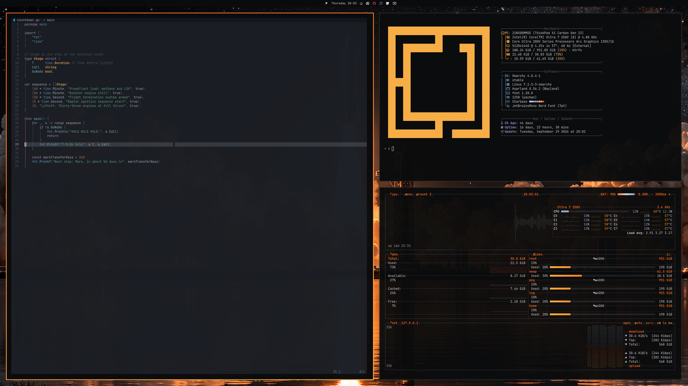
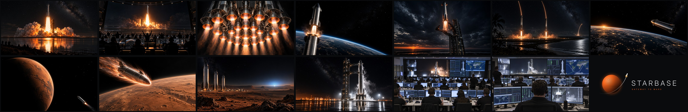
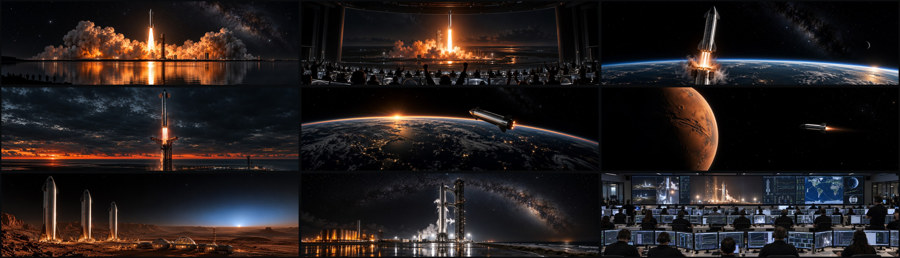
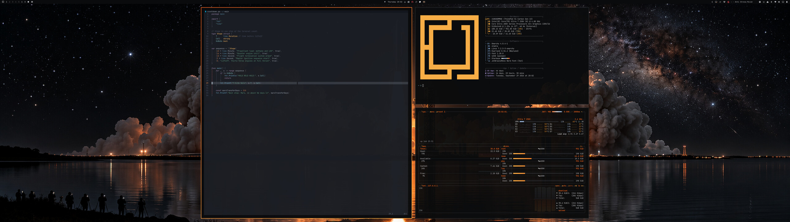
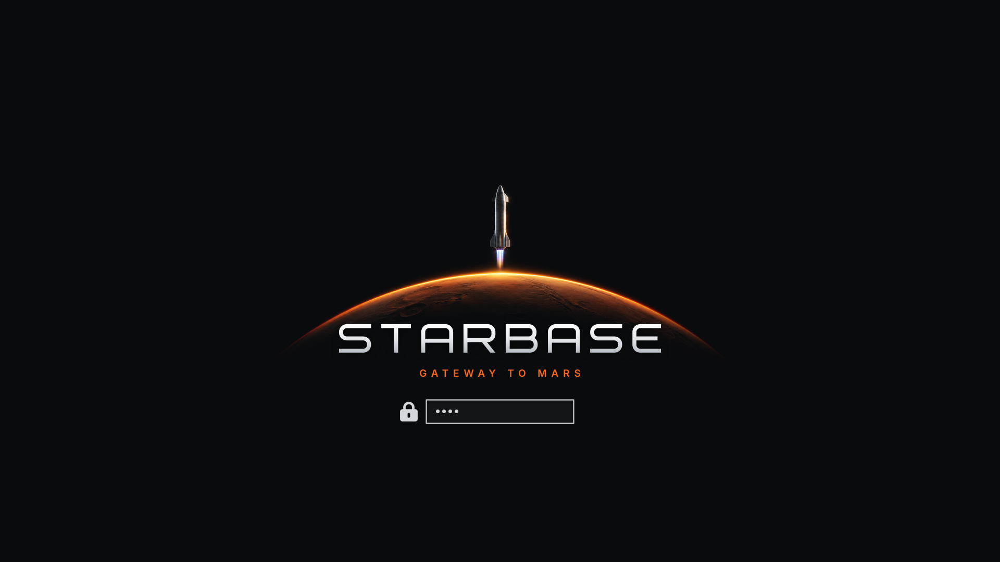

# Starbase

An [Omarchy](https://omarchy.org/) theme celebrating Starship, Starbase and the
long road to Mars. Space black, stainless-steel greys and whites, and one hot
accent taken from Mars and from a Raptor plume.

## Install

```bash
omarchy theme install https://github.com/renerocksai/omarchy-starbase-theme.git
```

That clones the repo into `~/.config/omarchy/themes/starbase` and applies it.
Switch back to it later with `omarchy theme set starbase`, update it with
`omarchy theme update`, and remove it with `omarchy theme remove starbase`.



## The palette

| Role | Colour | Where it comes from |
|---|---|---|
| Background | `#0a0b0d` | vacuum, night pads, a dark control room |
| Foreground | `#d4d7db` | stainless steel under floodlights |
| Bright | `#f4f5f7` | white-hot highlights |
| **Accent** | **`#f8661c`** | Mars regolith, re-entry plasma, engine exhaust |
| Green slot | `#ffb347` | burns exhaust-amber, as Matte Black does, so "go" states and the fastfetch logo glow like a plume |
| Blue | `#7ea3d0` | methalox flame |
| Cyan | `#86b9c4` | LOX frost venting off the tanks |
| Magenta | `#a995d6` | shock diamonds |
| Yellow | `#e9c46a` | sodium lamps over the tank farm |
| Red | `#e5484d` | abort |

Active window borders run an engine-plume gradient from Mars orange into hot
amber. Every app Omarchy themes (terminals, Neovim, btop, VS Code, the shell, the
launcher, Chromium, Helix, Obsidian) is generated from `colors.toml`. btop has
its own hand-tuned telemetry board, where graphs heat up from methalox blue
through steel to exhaust orange.

## The backgrounds

Thirteen backgrounds in 16:9, following one mission from liftoff to the first
city on Mars, back to the pad and into the room for the next go/no-go poll.
`01-liftoff` is a 6144×3456 (6K) master; the rest are 3840×2160.



1. Liftoff: across the water, thirty-three engines lit
2. Mission Control: the room at the moment of liftoff
3. Full Thrust: the engine cluster from below
4. Hot Staging: separation at the edge of space
5. Chopsticks: the booster catch at dusk
6. Twin Landing: two side boosters coming home
7. Orbital Sunrise: above the night side of Earth
8. Red Planet: approach
9. Entry Interface: plasma over Mars
10. First City: ships and habitats under a blue Martian sunset
11. Next Flight: the stack on the pad, venting, ready
12. Ground Control: the whole room on a launch-day webcast
13. Go for Launch: over a flight controller's shoulder

Cycle them with `omarchy theme bg next`, or pick one with
`omarchy theme bg-switcher`.

### Super-ultrawide (32:9)

Nine scenes are also composed natively for 5120×1440 monitors, in
`ultrawide/`. They are not in `backgrounds/`, so a 16:9 screen never gets a
cropped panorama. To use them, copy them into your own backgrounds folder for
this theme:

```bash
mkdir -p ~/.config/omarchy/backgrounds/starbase
cp ~/.config/omarchy/themes/starbase/ultrawide/*.jpg ~/.config/omarchy/backgrounds/starbase/
omarchy theme set starbase
```





## Unlock screen



The disk-unlock screen shows a Starship rising off the sunlit limb of Mars, over
a STARBASE wordmark drawn for this theme. Choose it under Style › Unlock, or run
`omarchy-plymouth-set-by-theme starbase` (needs sudo, and rebuilds the
initramfs).

## Credits

The backgrounds and the unlock-screen artwork were generated with OpenAI's image
model through the Codex CLI. The backgrounds were then upscaled with SeedVR2 7B
(ByteDance Seed, Apache-2.0) in ComfyUI, running in overlapping tiles on Apple
Silicon. The palette, the btop theme and the STARBASE wordmark were made by hand
for this theme.

Starbase is an unofficial fan tribute. It is not affiliated with, sponsored by,
or endorsed by Space Exploration Technologies Corp. SpaceX, Starship, Starbase,
Super Heavy, Raptor and Falcon are trademarks of their respective owners. The
artwork contains no official logos.
